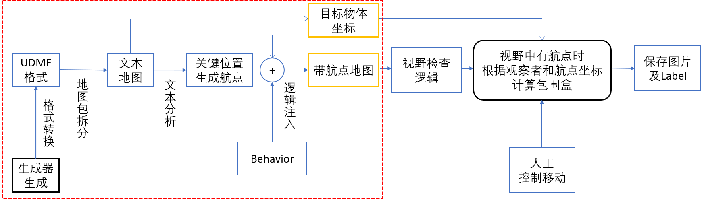

## baselines
对原baselines的a2c文件夹少量修改，主要增加了命令行参数输入、区分模型name_scope。运行训练脚本必需。下载
https://cloud.tsinghua.edu.cn/f/3bfba59b2820468a87dd/?dl=1
## mapconfigurations 
PyOblige 不同需求的配置示例。
- gendoorkey.py 生成包含大量门的地图，可训练可测试。
- gensteep.py
生成纯粹为训练上楼的地图。
- gentest.py
生成可测试上楼-开门性能的地图。
## oblige 

原PyOblige的修改，用于生成Mapspots/自定义逻辑(用于门的标注).仅支持windows，其他系统需要自行查找资料修改。

- 格式转换,分两步
    1. zwadconv.exe
    2. wad2udmf.exe
- 地图包拆分

    将二进制部分与文本文件(TEXTMAP分离，便于修改后者)
    - WADex.exe
    
- 文本分析
    依据udmf地图的格式，line的special为特定值表示门/转送门/出口。故依line-vertex顺序找到line端点(即门框)的坐标(X/Y)，依line-side-sector顺序找到门处于区域的上下边沿高度(Z)。这样就能得到完整的三维坐标。

- 生成航点
    向地图中追加写入若干Mapspot，为视野检查所用。

- 逻辑注入
    1. 加入USER_VARIABLE：表示(在当前位置)哪些Mapspot可见，哪些不可见。我们只计算可见Mapspot的Bounding Box。
    2. 加入特殊效果，包含:
        - 免疫所有伤害
        - 无限子弹状态
        - 初始给钥匙。

- 输出
    1. 目标物体坐标：门/出口/传送门的上下边沿高度及XY坐标。
    2. 带航点地图:原地图+生成航点+逻辑注入，使用WADex组装成完整地图包。

为避免修改版Oblige在非win系统中运行的困难，提供1000张的修改过地图。详见 https://github.com/guotata1996/train_a2c

## mapinfo 

修改版PyOblige使用的第三方软件、所用的ACS脚本等。配合修改版oblige.py。仅支持windows。

- behaviors/acsscript_full.txt:包含全部上述功能的ACS脚本。
- behaviors/BEHAVIOR_full:
经过ACC编译后的acsscript_full脚本
- behaviors/BEHAVIOR_nokey:
BEHAVIOR_full的功能，去除'初始给钥匙'(需自己找钥匙)
- behaviors/BEHAVIOR_none:
去除所有功能
- BEHAVIOR:
把需要的(编译后)逻辑覆盖此文件。
- wad2udmf.exe、WADex.exe、zwadconv.exe: 地图处理软件，前面已介绍。